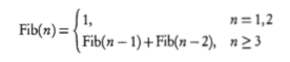
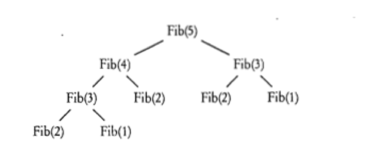

<notice>教程读者请不要直接阅读本文件，因为诸多功能在此无法正常使用，请移步至[程谱 coderecipe.cn](https://coderecipe.cn/learn/5)学习完整教程。如果您喜欢我们的教程，请在右上角给我们一个“Star”，谢谢您的支持！</notice>
递归
======

从这里开始学习吧！💖

递归方法
------
**递归方法**（recursion methods）简单地说就是直接或间接地调用自己的方法。比如这就是一个最简单的递归方法：
```java
public void recursion()
{
	recursion();
} 
```

千万别运行这个函数！因为如果我们主动调用了`recursion()`，然后在这个方法里`recursion()`会再调用，然后又再次调用……一直这样下去，导致电脑卡住，最后还会导致Java报错（实际上是一个叫做“栈”的结构存不下了），程序被迫退出。

递归的最简形式
-----

要理解递归，我们要先理解**栈**（stack）这个概念。栈就像烤串的签，我们往里插东西（叫压栈或者入栈，push），先插进去的在下，后插进去的在上，并且最后拿（叫出栈，pop）的时候，只有上面拿出来了才能拿出下面的。在Java里，每调用一个函数都是往栈里面存储了一个新的状态，就像往签上插了东西一样。

在Java里，每调用一个函数都会先暂停当前函数的状态，然后用一个新的状态来从头执行这个函数。这两个函数中定义的变量可以是不相同的。

知道了栈的定义，接下来让我们来看一个递归的小例子：

<lab lang="java" parameters="filename=Hello.java">
<notice>练习环境在此无法显示，请移步至[程谱 coderecipe.cn](https://coderecipe.cn/learn/5)查看。</notice>
public class Hello {
  public static void main(String[] args) {
      recursion(3);
  }
  public static void recursion(int val) {
    System.out.println(val);
    if (val>0) {
      recursion(val-1);
    }
  } 
}
</lab>

运行以后我们会发现输出了3、2、1和0。这是因为首先我们调用了`recursion`函数并给了参数3，根据上面的说明，在栈上压入了`recursion`这个状态，并且里面的`val`是3，然后输出3。然后又调用了一次`recursion`，参数为`2`，又压栈，输出2。一直这样下去，直到最后状态中的`val`值为0，`if`语句不执行为止。然后我们碰到了函数的末尾，释放出来，最后结束，依次反过来释放三个栈中的状态。

除了上面的那个会一直运行下去的递归函数，每个递归函数都有两个部分：
1. 一个基本的条件来终止递归的继续调用
2. 非基本条件使递归向基本条件运行
也就是说，递归的最终目的是遇到那个我们需要的“基本条件”，然后就不继续递归了。
	
在上面的例子中，让`val`不再大于0就是我们所需要达到的目的，达到目的之后我们就会终止调用本身了，我们在这个方法的结尾调用了`recursion`，后面就没有内容了，这样的递归就是结尾递归（tail recursion）。

分析递归函数
------
比如我们有如下的一个递归函数：
```java
public static int fib(int n){
if(n == 1||n == 2){
  return 1;
} else {
  return fib(n - 1) + fib(n - 2);
}
```
于是我们就要开始展开分析工作了，首先我们可以发现，在n == 1或n == 2的时候这个方法会返回1，其他时候会返回fib(n - 1) + fib(n - 2)，也就可以写成如下函数（n是正整数）：

然后我们开始计算函数的返回值，从fib(5)开始，通过对数学函数的分析我们可以画出如下的分析图。

因为每一个函数都会调用两个函数，所以树状分析图看起来会比栈图简洁明了，从下往上，把下面的两个小树枝（子节点）的数值计算出来，相加就得到上面的数值，最后就能计算出fib(5)了，结果是5。

递归的注意事项
------
从上面的分析图可以看出，函数`fib`每一次递归都需要调用两个子函数，而这两个子函数又会调用其它函数。刚才我们说过，函数调用的时候需要使用栈来存储当前函数和调用的函数的状态，因此在有大量函数调用的情况下，就要频繁访问栈来存取函数的状态，这样就会消耗掉大量的时间。因此如果有简单的循环能解决这个问题，就尽量不要使用递归来解决。另外递归还有如下需要注意的地方：
1. 在递归中尽量不要使用过多局部变量、局部数组，因为在函数调用时计算机要再次初始化局部变量、局部数组，而这样会消耗大量时间
2. 只在递归可以大量简化代码的时候使用，如果能用循环等简单解决就不要使用递归
3. 递归在以下两个方面很有用：分支树的处理和二进制等分支搜索
4. 可以使用帮助方法（helper method）来调用递归，这样可以使代码更简洁

小练习
------
让我们来练习一下我们刚学习的知识吧。
<lab lang="java" parameters="filename=Hello.java">
<notice>练习环境在此无法显示，请移步至[程谱 coderecipe.cn](https://coderecipe.cn/learn/5)查看。</notice>
public class Hello {
  public static void main(String[] args) {
      // 在这里输入代码
  }
}
</lab>
