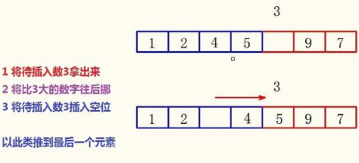

<notice>教程读者请不要直接阅读本文件，因为诸多功能在此无法正常使用，请移步至[程谱 coderecipe.cn](https://coderecipe.cn/learn/5)学习完整教程。如果您喜欢我们的教程，请在右上角给我们一个“Star”，谢谢您的支持！</notice>
排序
======

在这一章，我们要学习几种在计算机算法中极其重要的排序算法，不过放轻松，AP这部分不会直接让我们写一个排序算法，因此我们只需要理解这几个算法的异同就可以啦~让我们这就开始吧！💖

所谓的**排序**（sorting），就是让一个数组里的数，按照从大到小或者从小到大排列。下面是几种常用的排序算法：

选择排序
------
**选择排序**（selection sort）就是首先在数组中找到最小的一个值放在第一位，然后再找次小的放到第二位，以此类推一直到n-1次排序后，就能够得到一个递增的数列了。

以下是选择排序在Java里的一种实现，大家可以在纸上用一个实验数据来演算一遍：
```java
/*
    @param elements an array containing the items to be sorted.
    
    Postcondition: elements contains its original items and items 
                   in elements are sorted in ascending order.
*/
public static void selectionSort(int[] elements){
    for (int j = 0; j <elements.length){
        int minIndex = j;
        for (int k = j+1; k < elements .length;k++){
            if (elements[k]<elements[minIndex])
                minIndex = k;
        }
        int temp = elements[j];
        elements[j]= elements[minIndex];
        elements[minIndex] = temp;
    }
}
```

插入排序
-----
**插入排序**（insertion sort）的原本是一个排列好的数组插入一个数组。当我们把第一个数elements[0]看成一个数组时，我们就能够对整个数组进行插入排列。我们是将要插入的数组的第一个数拿出来，一个一个往前推，看哪个合适插在哪里。之后依次类推。
e.g.蓝色是我们已经排好的数组，红色为未排好的。

```java
/*
    @param elements an array containing the items to be sorted.
    
    Postcondition: elements contains its original items and items 
                   in elements are sorted in ascending order.
*/
public static void insertionSort(int[] elements){
    for(int j = 1; j< elements.length; j++){
        int temp = elements[j];
        int possibleIndex = j;
        while(possibleIndex > 0 && temp < elements[possibleIndex - 1]){
            elements[possibleIndex] = elements[possibleIndex - 1];
            possibleIndex --;
        }
        elements[possibleIndex] = temp;
    }
}
```

归并排序
------
**归并排序** （merge esort）是一种递归排序，它将数组拆成几个小的单元，之后对小的单元进行排序。然后再把小的单元组合在一起再进行排序。
它的缺点十分明显：它需要储存一个跟原始数组一样长的数据。它还有个显著特点，就是排序时间不受原本数据排序的影响，不论是最好的情况还是最坏的情况。

```java
public static void mergeSort(int[] elements){
    int n = elements.length;
    int[] temp = new int[n];
    mergeSortHelper(elements,0,n-1,temp);
}

/*
* @param elements, an array containing the items to be sorted.
* @param from, the begining index of the items in elements to be sorted.
* @param to, the ending index of the itens in elements to be sorted.
* @param temp, a temporary array to use during the merge process.
*   Precondition: 
*       (elements.length == 0 || 
*           0<= from <= to <= elements.length &&
*           elements.length == temp.length)
*   Postcondition:
*       elements contains its original items and the items in 
*       elements[from]...<= elements[to] are sorted in ascending order
*/
private static void mergeSortHelper(int[] elements, int from, int to, int[] temp){
    if (from < to){
        int middle = (from + to)/2;
        mergeSortHelper(elements, from , middle, temp);
        mergeSortHelper(elements, middle+1, to, temp);
        merge(elements, from, middle,to,temp);
    }
}

private static void merge(int[] elements, int from, int mid, int to, int[] temp){
    int i = from;
    int j = mid +1;
    int k = from;
    
    while(i<=mid && j <=to){
        if(elements[i]<elements[j]){
            temp[k] = elements[i];
            i++;
        }
        else{
            temp[k] = elements[j];
            j++
        }
        k++;
    }
    while (i <= mid){
        temp[k] = elements[i];
        i++;
        k++;
    }
    
    while(j<=to){
        temp[k] = elements[j];
        j++;
        k++
    }
    
    for (k = from; k<=to; k++)
        elements[k] = temp[k];
}
```
小练习
------
让我们来练习一下我们刚学习的知识吧。
<lab lang="java" parameters="filename=Hello.java">
<notice>练习环境在此无法显示，请移步至[程谱 coderecipe.cn](https://coderecipe.cn/learn/5)查看。</notice>
public class Hello {
  public static void main(String[] args) {
      // 在这里输入代码
  }
}
</lab>
